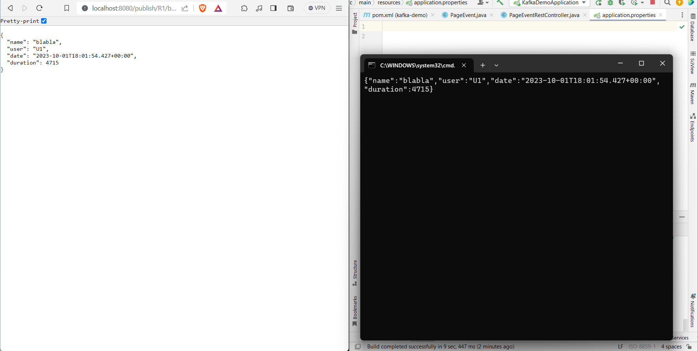
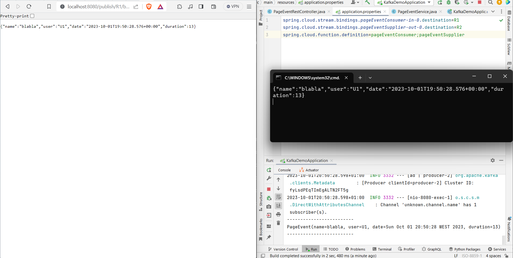
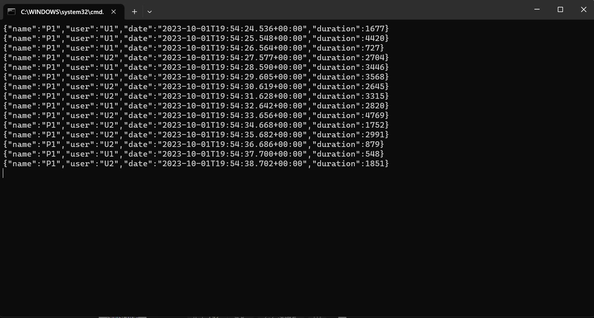
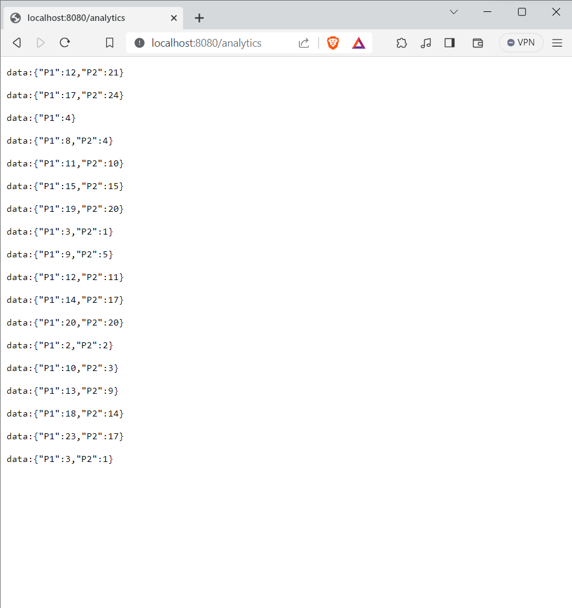
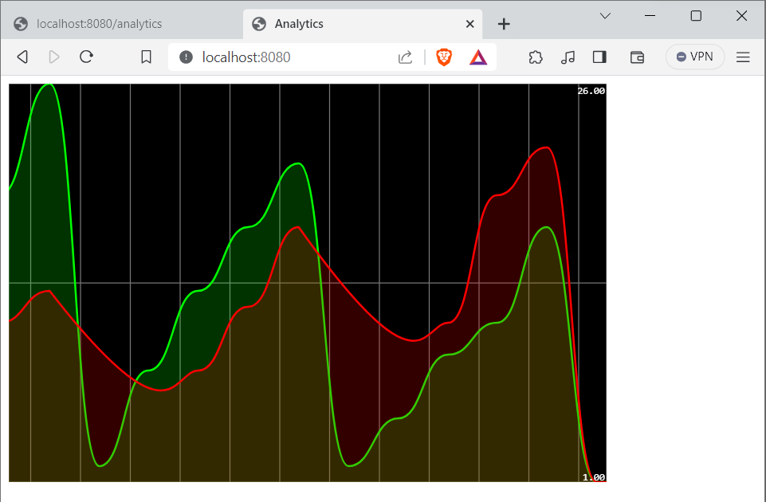

# Event Driven Architecture

#### Service Producer KAFKA via un Rest Controler

#### Service Consumer KAFKA

#### Service Supplier KAFKA

#### Service de Data Analytics Real Time Stream Processing avec Kaflka Streams

#### Application Web afin d'afficher le Stream Data Analytics en temps réel

